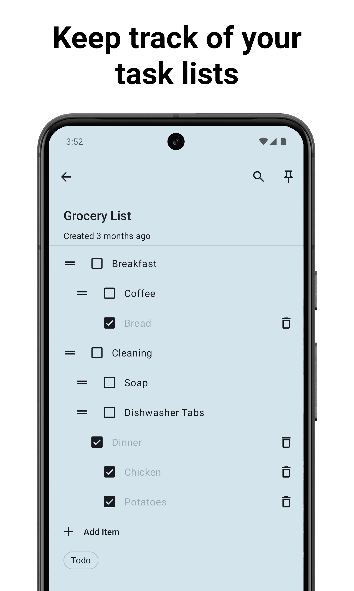
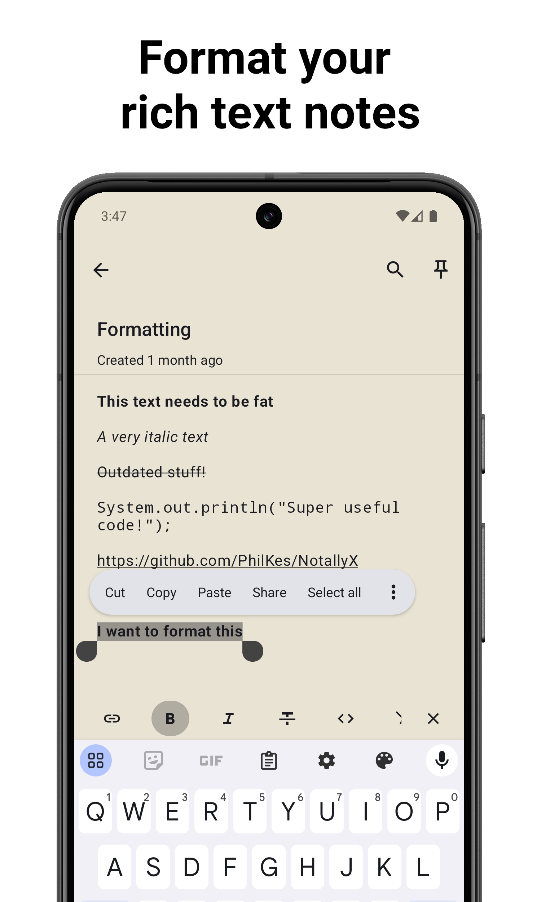
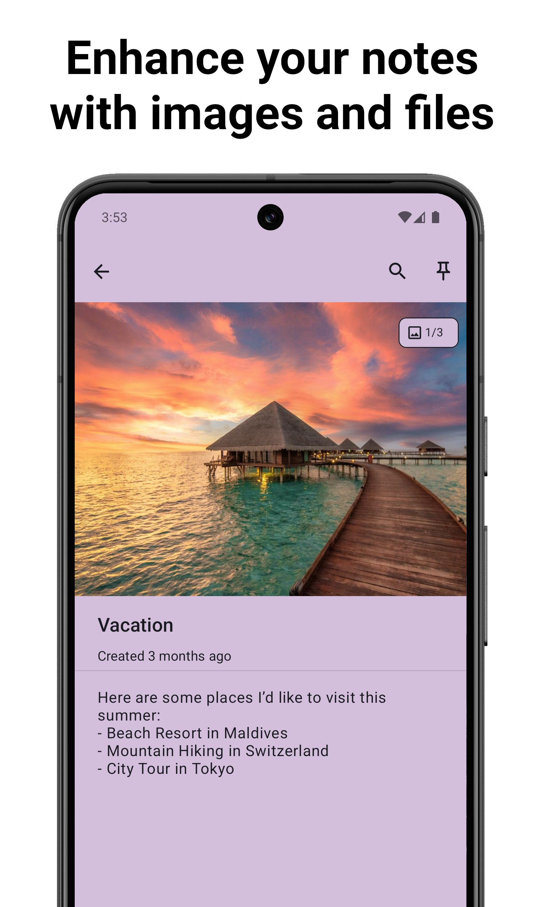
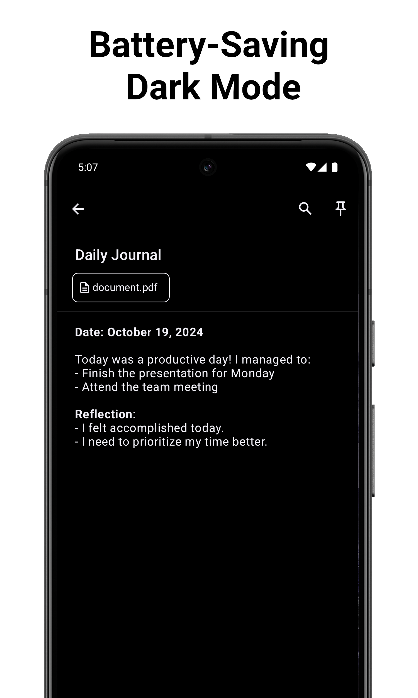

<h2 align="center">
    
    <br />
    <b><a href="https://github.com">NotablyMD | A minimalistic markdown-first note taking app</a></b>
</h2>

<div style="display: flex; justify-content: space-between; width: 100%;">
  
  
  
</div>

<div style="display: flex; justify-content: space-between; width: 100%;">
  
  
  
</div>


### Features
[NotallyX](https://github.com/Crustack/NotallyX), but optimized for easy **cross-device sync** and **markdown-first storage**

* Create **rich text** notes with support for bold, italics, mono space and strike-through
* Create **task lists** and order them with subtasks (+ auto-sort checked items to the end)
* Set **reminders** with notifications for important notes
* Complement your notes with any type of file such as **pictures**, PDFs, etc.
* **Sort notes** by title, last modified date, creation date
* **Color, pin and label** your notes for quick organisation
* Add **clickable links** to notes with support for phone numbers, email addresses and web urls
* **Undo/Redo actions**
* Use **Home Screen Widget** to access important notes fast
* **Lock your notes via Biometric/PIN**
* Configurable **auto-backups**
* Create quick audio notes
* Display the notes either in a **List or Grid**
* Quickly share notes by text
* Extensive preferences to adjust views to your liking
* Actions to quickly remove checked tasks
* Adaptive android app icon
* Support for Lollipop devices and up

### 🚀 Markdown-First Features (Coming Soon)

* **Cross-device sync** via Syncthing, Dropbox, or any cloud storage
* **Universal access** - notes work in any markdown editor
* **Version control friendly** - plain text format compatible with Git
* **Real-time collaboration** - multiple device editing with conflict resolution
* **Advanced import/export** - Evernote, Google Keep, JSON, Plain Text support
* **Encrypted markdown files** - secure cloud storage with SQLCipher
* **File watching** - automatic sync when external files change
* **YAML frontmatter** - rich metadata in standard markdown format

---

## 📱 Installation

### Download
- **Google Play**: [Coming Soon]
- **F-Droid**: [Coming Soon]  
- **GitHub Releases**: [Latest APK](https://github.com)

### Requirements
- **Android**: 5.0 (Lollipop) and up
- **Storage**: Permission for external storage (for markdown sync)
- **Biometrics**: Optional (for app lock)

---

## 🔧 Development

### Quick Start
```bash
git clone https://github.com/yourusername/notablymd.git
cd NotablyMD
chmod +x gradlew
./gradlew assembleDebug installDebug
```

### Build Requirements
- **Java**: JDK 21+
- **Android Studio**: Latest stable
- **Target SDK**: 35
- **Kotlin**: 2.1.0
- **Gradle**: 8.12

### Code Style
This project uses **ktfmt** for code formatting with pre-commit hooks:
```bash
./gradlew ktfmtFormat  # Format code
./gradlew test        # Run tests
```

---

## 📖 Documentation

- **[QUICK_START.md](./QUICK_START.md)** - Development setup guide
- **[DEVELOPMENT_CHECKLIST.md](./DEVELOPMENT_CHECKLIST.md)** - Comprehensive development workflow
- **[TRANSLATIONS.md](./TRANSLATIONS.md)** - Translation guidelines

---

## 🤝 Contributing

We welcome contributions! See [DEVELOPMENT_CHECKLIST.md](./DEVELOPMENT_CHECKLIST.md) for detailed development guidelines.

### Areas for Contribution
- **Markdown sync engine** - bidirectional DB ↔ file synchronization
- **File watching** - external file change detection  
- **Conflict resolution** - multi-device editing conflicts
- **UI/UX** - sync status indicators, settings screens
- **Security** - encrypted markdown file storage
- **Performance** - large collection optimization

### Development Workflow
1. Fork the repository
2. Create feature branch: `git checkout -b feature/your-feature`
3. Format code: `./gradlew ktfmtFormat`
4. Run tests: `./gradlew test connectedAndroidTest`
5. Submit pull request

---

## 🗺️ Roadmap

### Phase 1: Foundation (Current)
- ✅ Enhanced CommonMark markdown processing
- ✅ Advanced import/export framework  
- ✅ Security and encryption infrastructure
- 🔄 File watching and sync engine
- 🔄 Bidirectional DB ↔ markdown sync

### Phase 2: User Experience
- 📋 Storage location picker
- 📊 Sync status indicators
- ⚠️ Conflict resolution UI
- ⚙️ Enhanced settings screens

### Phase 3: Advanced Features
- 🔐 Encrypted markdown files
- 🌐 Cross-device collaboration
- 📈 Performance optimization
- 🔄 Selective sync by labels/folders

---

## 📄 License

This project is licensed under **GPL 3.0 License** - see [LICENSE.md](./LICENSE.md) for details.

### Attribution
The original Notally projects were developed by [OmGodse](https://github.com/OmGodse/Notally) and [Crustack](https://github.com/Crustack/NotallyX) under the GPL 3.0 License.

This markdown-first edition builds upon their excellent work to enable cross-device synchronization and universal markdown compatibility.
